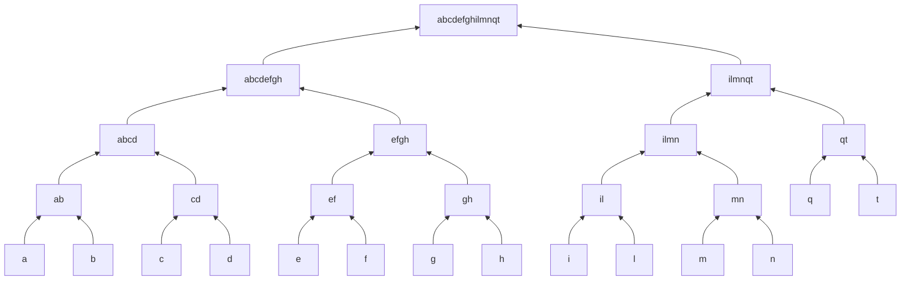

# 02 — Hierarchical and Density-Based Clustering

> Lecture 5 · Problems M5–M11

## M5. AGNES and DIANA (2023 exam, Q3c)

*Design a dendrogram for the objects {a, b, c, d, e, f, g, h, i, l, m, n, q, t} using agglomerative and divisive clustering.*

| | AGNES (agglomerative) | DIANA (divisive) |
|---|---|---|
| Direction | Bottom-up | Top-down |
| Start | Each object is its own cluster | All objects in one cluster |
| Each step | Merge the two closest clusters | Split one cluster into two |
| Stop | One cluster remains | Every object is alone |

With n objects, AGNES performs exactly **n − 1 merges**, and DIANA the same number of splits in reverse. The question says "10 objects" but lists 14, so the answer uses all 14: **13 levels**. No distances are given, so the merge order below assumes neighbouring letters are closest:



Read upward, this is AGNES (13 merges); read downward, it is DIANA (13 splits). Cutting the tree at any height gives a clustering; e.g., just below the top gives {abcdefgh} and {ilmnqt}. Neither method can undo a merge or split once it is made.

---

## M6. Clustering feature and additivity (BIRCH)

BIRCH summarizes a cluster as `CF = ⟨N, LS, SS⟩`, where LS = Σ xᵢ and SS = Σ xᵢ², computed per dimension.

Cluster 1 = {(2,5), (3,2), (4,3)}:

```text
N1 = 3
LS1 = (2+3+4, 5+2+3) = (9, 10)
SS1 = (4+9+16, 25+4+9) = (29, 38)
CF1 = ⟨3, (9, 10), (29, 38)⟩
```

**Additivity theorem:** for disjoint clusters, `CF(C1 ∪ C2) = CF1 + CF2`. With CF2 = ⟨3, (35, 36), (417, 440)⟩:

```text
CF3 = ⟨3+3, (9+35, 10+36), (29+417, 38+440)⟩ = ⟨6, (44, 46), (446, 478)⟩
```

For 2-D data, SS is a **pair** (Σx², Σy²), not a single number.

## M7. Clustering feature of Cluster 3 (2023 exam, Q4a)

Cluster 2 = {(4,5), (3,2), (3,4)}:

```text
CF2 = ⟨3, (10, 11), (16+9+9, 25+4+16)⟩ = ⟨3, (10, 11), (34, 45)⟩
CF3 = CF1 + CF2 = ⟨6, (19, 21), (63, 83)⟩
```

From CF3 alone: centroid `(19/6, 21/6) = (3.17, 3.50)` and radius `R = √[(63/6 − 3.1667²) + (83/6 − 3.5²)] = √(0.4722 + 1.5833) = 1.434`.

## M8. Centroid, radius and diameter from a CF

Using CF1 = ⟨3, (9, 10), (29, 38)⟩ and no raw points:

```text
centroid  x0 = LS/N = (3, 3.33)

radius    R = √( Σ_dims [ SS/N − (LS/N)² ] )
            = √( (29/3 − 9) + (38/3 − 100/9) ) = √(2/3 + 14/9) = √(20/9) ≈ 1.49

diameter  Σ_i Σ_j ‖xᵢ − xⱼ‖² = Σ_dims (2N·SS − 2·LS²) = (174 − 162) + (228 − 200) = 40
          D = √( 40 / (N(N−1)) ) = √(40/6) ≈ 2.58
```

The denominator is `N(N − 1)` because the double sum counts each unordered pair twice and the N diagonal terms are zero. (Dividing by N² or N instead gives a different value, so the convention should be stated.)

---

## M9. Jaccard coefficient on transactions (2023 exam, Q7a)

Cluster 1 = all 3-item subsets of {a, b, c, d, e} (there are C(5,3) = 10), and Cluster 2 = {abf, abg, afg, bfg}.

```text
sim(Tᵢ, Tⱼ) = |Tᵢ ∩ Tⱼ| / |Tᵢ ∪ Tⱼ|

same cluster:       sim({a,b,c}, {b,d,e}) = 1/5 = 0.2
different clusters: sim({a,b,c}, {a,b,f}) = 2/4 = 0.5
```

Two transactions from **different** clusters score higher than two from the **same** cluster. A pairwise distance like Jaccard therefore produces poor clusters on categorical data, which motivates ROCK.

*(The 2023 paper lists nine subsets for Cluster 1; {b, c, d} is missing. All ten are used here.)*

## M10. ROCK links

Transactions are **neighbours** if `sim ≥ θ`. With θ = 0.5 and 3-item sets, that means they share at least 2 items. `link(Tᵢ, Tⱼ)` is the number of **common neighbours**:

```text
N({a,b,f}) = {abc, abd, abe, abg, afg, bfg}
N({a,b,g}) = {abc, abd, abe, abf, afg, bfg}
N({a,b,c}) = {abd, abe, abf, abg, acd, ace, bcd, bce}

link({a,b,f}, {a,b,g}) = |{abc, abd, abe, afg, bfg}| = 5
link({a,b,f}, {a,b,c}) = |{abd, abe, abg}|           = 3
```

Jaccard rates both pairs at 0.5 and cannot separate them. Links do: 5 > 3, so ROCK correctly groups {a,b,f} with {a,b,g}. Links capture **neighbourhood context** rather than isolated pairwise overlap.

---

## M11. DBSCAN

Apply DBSCAN with `ε = 1.9` and `MinPts = 4` (the point itself counts) to:

| | P1 | P2 | P3 | P4 | P5 | P6 | P7 | P8 | P9 | P10 | P11 | P12 |
|---|---|---|---|---|---|---|---|---|---|---|---|---|
| x | 3 | 4 | 5 | 6 | 7 | 6 | 7 | 8 | 9 | 2 | 3 | 2 |
| y | 7 | 6 | 5 | 4 | 3 | 2 | 2 | 4 | 5 | 6 | 5 | 4 |

**Shortcut:** compare squared distances with `ε² = 3.61`. On integer coordinates only `Δx² + Δy² ∈ {1, 2}` qualifies; a sum of 4 means d = 2.0 > 1.9. Of the 66 pairs, **13** are neighbours.

| Point | ε-neighbourhood | Size | Type |
|---|---|---:|---|
| P1 | P1, P2, P10 | 3 | Border (via P2) |
| **P2** | P1, P2, P3, P11 | 4 | **Core** |
| P3 | P2, P3, P4 | 3 | Border (via P2) |
| P4 | P3, P4, P5 | 3 | Border (via P5) |
| **P5** | P4, P5, P6, P7, P8 | 5 | **Core** |
| P6 | P5, P6, P7 | 3 | Border (via P5) |
| P7 | P5, P6, P7 | 3 | Border (via P5) |
| P8 | P5, P8, P9 | 3 | Border (via P5) |
| P9 | P8, P9 | 2 | **Noise** |
| P10 | P1, P10, P11 | 3 | Border (via P11) |
| **P11** | P2, P10, P11, P12 | 4 | **Core** |
| P12 | P11, P12 | 2 | Border (via P11) |

P9 is noise because its only neighbour, P8, is a border point, not a core point. P12 has only two points in its neighbourhood, but one of them (P11) is core, so it is a border point.

**Clusters:** core points P2 and P11 are within ε of each other (d = 1.41), so they are density-connected and their neighbourhoods merge. P5 is far from both.

```text
Cluster A = {P1, P2, P3, P10, P11, P12}
Cluster B = {P4, P5, P6, P7, P8}
Noise     = {P9}
```

Unlike K-means, DBSCAN found the number of clusters itself and labelled the outlier explicitly.
