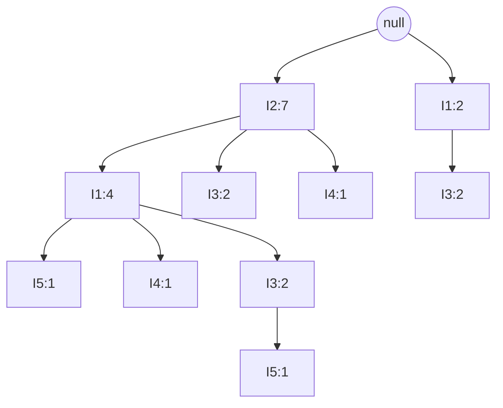

# 04 — Frequent Patterns, Association Rules and Correlation

> Lecture 7B · Problems M15–M24

## Definitions

- **Support count** of itemset X: the number of transactions containing X. X is **frequent** if its support ≥ min_sup.
- For a rule X ⇒ Y:

```text
support(X ⇒ Y)    = P(X ∪ Y)
confidence(X ⇒ Y) = P(Y | X) = support_count(X ∪ Y) / support_count(X)
```

- A rule meeting both min_sup and min_conf is **strong**. Support is symmetric between X ⇒ Y and Y ⇒ X; confidence is not.

Three databases are used below:

```text
BEER (5 txns)              A–E (4 txns)       I1–I5 (9 txns)
10: Beer, Nuts, Diaper     T10: A, C, D       T100: I1,I2,I5   T400: I1,I2,I4   T700: I1,I3
20: Beer, Coffee, Diaper   T20: B, C, E       T200: I2,I4      T500: I1,I3      T800: I1,I2,I3,I5
30: Beer, Diaper, Eggs     T30: A, B, C, E    T300: I2,I3      T600: I2,I3      T900: I1,I2,I3
40: Nuts, Eggs, Milk       T40: B, E
50: Nuts, Coffee, Diaper, Eggs, Milk
```

---

## M15. Support, confidence and strong rules (BEER, min_sup = min_conf = 50%)

50% of 5 transactions is 2.5, so a frequent itemset needs a count ≥ 3.

```text
Items:  Beer 3, Nuts 3, Diaper 4, Eggs 3, Milk 2 ✗, Coffee 2 ✗
Pairs:  only {Beer, Diaper} reaches 3 (T10, T20, T30)
```

**Frequent:** Beer:3, Nuts:3, Diaper:4, Eggs:3, {Beer, Diaper}:3

| Rule | Support | Confidence | Strong? |
|---|---:|---:|:---:|
| Beer ⇒ Diaper | 3/5 = 60% | 3/3 = 100% | ✓ |
| Diaper ⇒ Beer | 3/5 = 60% | 3/4 = 75% | ✓ |

## M16. Apriori (A–E, min_sup = 2)

**Apriori property (downward closure):** every subset of a frequent itemset is frequent. Equivalently, if X is infrequent, no superset of X needs to be generated or counted.

**Scan 1:** A:2, B:3, C:3, **D:1 ✗**, E:3 → `L1 = {A, B, C, E}`

**Scan 2:** `C2` = all pairs of L1

| C2 | Count | |
|---|---:|---|
| {A,B} | 1 | ✗ |
| {A,C} | 2 | ✓ |
| {A,E} | 1 | ✗ |
| {B,C} | 2 | ✓ |
| {B,E} | 3 | ✓ |
| {C,E} | 2 | ✓ |

`L2 = {AC:2, BC:2, BE:3, CE:2}`

**Scan 3: join, then prune.** The join merges two (k−1)-itemsets that agree on their first k−2 items (in sorted order). In L2, only {B,C} and {B,E} share a first item, giving **{B,C,E}**. Its subsets {B,C}, {B,E} and {C,E} are all in L2, so it survives the prune step. Scanning gives a count of 2 (T20, T30), so `L3 = {BCE:2}`.

*(A candidate such as {A,B,C} is never even generated, since {A,C} and {B,C} differ in their first item. Had it been generated, the prune step would remove it, because {A,B} ∉ L2.)*

With a single 3-itemset, no 4-itemset can be formed, so the algorithm stops.

**Answer:** {A}, {B}, {C}, {E}; {A,C}, {B,C}, {B,E}, {C,E}; {B,C,E}

## M17. Apriori (BEER, min_sup = 2) (2023 exam, Q4c)

With the lower threshold, all six items are frequent. Of the 15 pairs, seven survive:

```text
L2 = {Beer,Diaper}:3, {Coffee,Diaper}:2, {Diaper,Eggs}:2, {Diaper,Nuts}:2,
     {Eggs,Milk}:2, {Eggs,Nuts}:2, {Milk,Nuts}:2
```

**Join:** {Diaper,Eggs} ⋈ {Diaper,Nuts} → {Diaper,Eggs,Nuts}; {Eggs,Milk} ⋈ {Eggs,Nuts} → {Eggs,Milk,Nuts}. Both pass the subset test.

| C3 | Found in | Count | |
|---|---|---:|---|
| {Diaper, Eggs, Nuts} | 50 | 1 | ✗ |
| {Eggs, Milk, Nuts} | 40, 50 | 2 | ✓ |

**Answer:** L1 = all six items; L2 = the seven pairs above; L3 = {Eggs, Milk, Nuts}:2, the maximal frequent itemset.

## M18. Generating rules from {I1, I2, I5} (min_conf = 70%)

A k-itemset L yields `2^k − 2` rules S ⇒ (L − S). Here k = 3, giving 6 rules. The numerator is always `support_count(L) = 2`.

| Rule | Confidence | Strong? |
|---|---|:---:|
| I1 ∧ I2 ⇒ I5 | 2/4 = 50% | |
| I1 ∧ I5 ⇒ I2 | 2/2 = 100% | ✓ |
| I2 ∧ I5 ⇒ I1 | 2/2 = 100% | ✓ |
| I1 ⇒ I2 ∧ I5 | 2/6 = 33% | |
| I2 ⇒ I1 ∧ I5 | 2/7 = 29% | |
| I5 ⇒ I1 ∧ I2 | 2/2 = 100% | ✓ |

---

## M19. DHP: hash-based pruning (A–E, min_sup = 2) (2023 exam, Q1c)

**Idea:** during scan 1, also hash every 2-itemset of every transaction into a bucket. A bucket whose total count is below min_sup cannot contain a frequent pair, so its pairs are removed from C2 before scan 2.

Hash function, with A=1, …, E=5: `h(x, y) = (10·order(x) + order(y)) mod 7`

| Bucket | Pairs hashed into it | Count | Bit |
|---:|---|---:|:---:|
| 0 | {A,D}, {C,E}, {C,E} | 3 | 1 |
| 1 | {A,E} | 1 | 0 |
| 2 | {B,C}, {B,C} | 2 | 1 |
| 3 | — | 0 | 0 |
| 4 | {B,E}, {B,E}, {B,E} | 3 | 1 |
| 5 | {A,B} | 1 | 0 |
| 6 | {A,C}, {C,D}, {A,C} | 3 | 1 |

Of the 6 candidate pairs from L1 = {A, B, C, E}, {A,B} (bucket 5) and {A,E} (bucket 1) are pruned **without a scan**:

```text
C2 = {A,C}, {B,C}, {B,E}, {C,E}
```

Apriori then continues as in M16. A passing bucket does **not** prove a pair is frequent: bucket 0 reaches 3 only because {A,D} collided with {C,E}. DHP is a filter, and the survivors still need counting.

## M20. DHP (I1–I5, min_sup = 3)

```text
L1 = {I1:6, I2:7, I3:6}            (I4:2 and I5:2 fall below 3)
bucket totals = [2, 2, 4, 2, 2, 4, 4]
```

{I1,I2} → bucket 5 (4), {I1,I3} → bucket 6 (4), {I2,I3} → bucket 2 (4): all three candidates pass, and each has an actual count of 4.

## M21. Transaction reduction (min_sup = 2)

A transaction that contains no frequent k-itemset cannot contain a frequent (k+1)-itemset, so it can be skipped in later scans.

```text
T1: I1, I2, I5    T2: I2, I3, I4    T3: I3, I4    T4: I1, I2, I3, I4

L1 = {I1, I2, I3, I4}                      (I5:1 removed)
L2 = {I1,I2}:2, {I2,I3}:2, {I2,I4}:2, {I3,I4}:3
```

For k = 3, a transaction must still hold at least 3 items that occur in its frequent pairs. T1 ({I1,I2}) and T3 ({I3,I4}) are dropped, leaving T2 and T4. The only candidate {I2,I3,I4} is counted on just those two transactions: count 2, so `L3 = {I2,I3,I4}`.

---

## M22. FP-Growth (I1–I5, min_sup = 2) (2023 exam, Q7c)

**Scan 1:** sort items by descending support to get the header table:

```text
I2:7, I1:6, I3:6, I4:2, I5:2
```

**Scan 2:** insert each transaction, reordered, into a prefix tree. Shared prefixes increment existing counts; new suffixes create nodes.



T500 and T700 (I1, I3) do not start with I2, so they form a **new branch** from the root. The node totals per item match the scan-1 counts (I1: 4 + 2 = 6; I3: 2 + 2 + 2 = 6).

**Mining**, bottom-up from the least frequent suffix. Each prefix path carries the count of the **suffix node**, not of its ancestors.

| Suffix | Conditional pattern base | Conditional FP-tree | Frequent patterns |
|---|---|---|---|
| I5 | {I2,I1}:1, {I2,I1,I3}:1 | ⟨I2:2, I1:2⟩ | {I2,I5}:2, {I1,I5}:2, {I2,I1,I5}:2 |
| I4 | {I2,I1}:1, {I2}:1 | ⟨I2:2⟩ | {I2,I4}:2 |
| I3 | {I2,I1}:2, {I2}:2, {I1}:2 | ⟨I2:4, I1:2⟩, ⟨I1:2⟩ | {I2,I3}:4, {I1,I3}:4, {I2,I1,I3}:2 |
| I1 | {I2}:4 | ⟨I2:4⟩ | {I2,I1}:4 |

Note that **{I2, I1, I3} has count 2, not 4**: I2 and I1 each co-occur with I3 four times, but they appear together with I3 on only one path.

**Answer:** 13 frequent itemsets: I2:7, I1:6, I3:6, I4:2, I5:2; {I1,I2}:4, {I1,I3}:4, {I2,I3}:4, {I2,I4}:2, {I1,I5}:2, {I2,I5}:2; {I1,I2,I3}:2, {I1,I2,I5}:2.

## M23. ECLAT: vertical format (2023 exam, Q5a)

ECLAT stores each itemset's **TID-set**; the support of X ∪ Y is `|TID(X) ∩ TID(Y)|`. After one transforming scan, the database is never read again.

```text
I1: {100, 400, 500, 700, 800, 900}   I2: {100, 200, 300, 400, 600, 800, 900}
I3: {300, 500, 600, 700, 800, 900}   I4: {200, 400}   I5: {100, 800}
```

| 2-itemset | TID-set | Support | |
|---|---|---:|---|
| {I1,I2} | {100, 400, 800, 900} | 4 | ✓ |
| {I1,I3} | {500, 700, 800, 900} | 4 | ✓ |
| {I1,I4} | {400} | 1 | ✗ |
| {I1,I5} | {100, 800} | 2 | ✓ |
| {I2,I3} | {300, 600, 800, 900} | 4 | ✓ |
| {I2,I4} | {200, 400} | 2 | ✓ |
| {I2,I5} | {100, 800} | 2 | ✓ |
| {I3,I5} | {800} | 1 | ✗ |

```text
{I1,I2} ∩ {I1,I3} → {I1,I2,I3}: {800, 900}  → 2 ✓
{I1,I2} ∩ {I1,I5} → {I1,I2,I5}: {100, 800}  → 2 ✓
{I1,I3} ∩ {I1,I5} → {I1,I3,I5}: {800}       → 1 ✗
{I1,I2,I3} ∩ {I1,I2,I5} → {800}             → 1 ✗   (stop)
```

The result is the same 13 itemsets as FP-Growth (M22): two different algorithms, horizontal prefix tree vs. vertical TID-sets, reach the same answer.

---

## M24. Correlation analysis: lift

Of 10,000 transactions, 6,000 contain computer games, 7,500 contain videos, and 4,000 contain both. min_sup = 30% and min_conf = 60%.

```text
support(games ⇒ videos)    = 4000/10000 = 40% ≥ 30%
confidence(games ⇒ videos) = 4000/6000  = 66.7% ≥ 60%      → the rule is "strong"
```

But `P(videos) = 75% > 66.7%`: buying games actually **lowers** the chance of buying videos. Confidence alone is misleading.

```text
Lift(A, B) = P(A ∪ B) / (P(A) P(B)) = 0.40 / (0.60 × 0.75) = 0.89 < 1
```

Lift < 1 means games and videos are **negatively correlated**, so the rule is not interesting despite passing both thresholds. (Lift > 1 means positive correlation; lift = 1 means independence.)
