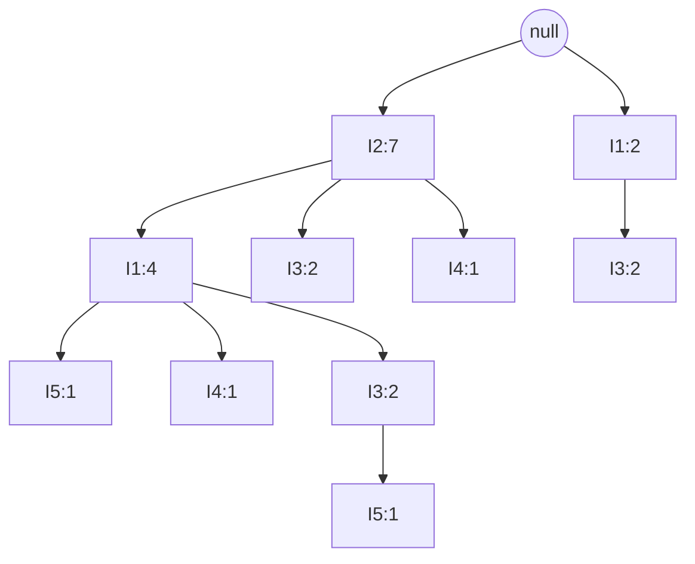

# 04 — Frequent Patterns, Association Rules and Correlation

> Lecture 7B · Problems M15–M24

## Definitions

- **Support count** of itemset X: the number of transactions containing X. X is **frequent** if its support ≥ min_sup.
- For a rule X ⇒ Y:

```text
support(X ⇒ Y)    = P(X ∪ Y)
confidence(X ⇒ Y) = P(Y | X) = support_count(X ∪ Y) / support_count(X)
```

- A rule meeting both min_sup and min_conf is **strong**. Support is symmetric between X ⇒ Y and Y ⇒ X; confidence is not.

Three databases are used below:

```text
BEER (5 txns)              A–E (4 txns)       I1–I5 (9 txns)
10: Beer, Nuts, Diaper     T10: A, C, D       T100: I1,I2,I5   T400: I1,I2,I4   T700: I1,I3
20: Beer, Coffee, Diaper   T20: B, C, E       T200: I2,I4      T500: I1,I3      T800: I1,I2,I3,I5
30: Beer, Diaper, Eggs     T30: A, B, C, E    T300: I2,I3      T600: I2,I3      T900: I1,I2,I3
40: Nuts, Eggs, Milk       T40: B, E
50: Nuts, Coffee, Diaper, Eggs, Milk
```

---

## M15. Support, confidence and strong rules (BEER, min_sup = min_conf = 50%)

50% of 5 transactions is 2.5, so a frequent itemset needs a count ≥ 3.

```text
Items:  Beer 3, Nuts 3, Diaper 4, Eggs 3, Milk 2 ✗, Coffee 2 ✗
Pairs:  only {Beer, Diaper} reaches 3 (T10, T20, T30)
```

**Frequent:** Beer:3, Nuts:3, Diaper:4, Eggs:3, {Beer, Diaper}:3

| Rule | Support | Confidence | Strong? |
|---|---:|---:|:---:|
| Beer ⇒ Diaper | 3/5 = 60% | 3/3 = 100% | ✓ |
| Diaper ⇒ Beer | 3/5 = 60% | 3/4 = 75% | ✓ |

**Answer:** frequent itemsets Beer:3, Nuts:3, Diaper:4, Eggs:3, {Beer, Diaper}:3. Rules: Beer ⇒ Diaper (60%, 100%) and Diaper ⇒ Beer (60%, 75%), both strong.

## M16. Apriori (A–E, min_sup = 2)

**Apriori property (downward closure):** every subset of a frequent itemset is frequent. Equivalently, if X is infrequent, no superset of X needs to be generated or counted.

**Scan 1: C1 → L1**

| C1 | Transactions | Count | |
|---|---|---:|---|
| {A} | T10, T30 | 2 | ✓ |
| {B} | T20, T30, T40 | 3 | ✓ |
| {C} | T10, T20, T30 | 3 | ✓ |
| {D} | T10 | 1 | ✗ |
| {E} | T20, T30, T40 | 3 | ✓ |

`L1 = {A:2, B:3, C:3, E:3}`; D is removed and never appears again.

**Scan 2:** `C2` = all pairs of L1

| C2 | Count | |
|---|---:|---|
| {A,B} | 1 | ✗ |
| {A,C} | 2 | ✓ |
| {A,E} | 1 | ✗ |
| {B,C} | 2 | ✓ |
| {B,E} | 3 | ✓ |
| {C,E} | 2 | ✓ |

`L2 = {AC:2, BC:2, BE:3, CE:2}`

**Scan 3: join, then prune.** The join merges two (k−1)-itemsets that agree on their first k−2 items (in sorted order). In L2, only {B,C} and {B,E} share a first item, giving **{B,C,E}**. Its subsets {B,C}, {B,E} and {C,E} are all in L2, so it survives the prune step. Scanning gives a count of 2 (T20, T30), so `L3 = {BCE:2}`.

*(A candidate such as {A,B,C} is never even generated, since {A,C} and {B,C} differ in their first item. Had it been generated, the prune step would remove it, because {A,B} ∉ L2.)*

With a single 3-itemset, no 4-itemset can be formed, so the algorithm stops.

**Answer:** {A}, {B}, {C}, {E}; {A,C}, {B,C}, {B,E}, {C,E}; {B,C,E}

## M17. Apriori (BEER, min_sup = 2) (2023 exam, Q4c)

**Scan 1:** with the lower threshold, all six items are frequent.

| Item | Transactions | Count |
|---|---|---:|
| Beer | 10, 20, 30 | 3 |
| Nuts | 10, 40, 50 | 3 |
| Diaper | 10, 20, 30, 50 | 4 |
| Coffee | 20, 50 | 2 |
| Eggs | 30, 40, 50 | 3 |
| Milk | 40, 50 | 2 |

**Scan 2:** six items give C(6,2) = 15 candidate pairs.

| Pair | Found in | Count | | Pair | Found in | Count | |
|---|---|---:|---|---|---|---:|---|
| {Beer, Coffee} | 20 | 1 | ✗ | {Coffee, Nuts} | 50 | 1 | ✗ |
| {Beer, Diaper} | 10, 20, 30 | 3 | ✓ | {Diaper, Eggs} | 30, 50 | 2 | ✓ |
| {Beer, Eggs} | 30 | 1 | ✗ | {Diaper, Milk} | 50 | 1 | ✗ |
| {Beer, Milk} | — | 0 | ✗ | {Diaper, Nuts} | 10, 50 | 2 | ✓ |
| {Beer, Nuts} | 10 | 1 | ✗ | {Eggs, Milk} | 40, 50 | 2 | ✓ |
| {Coffee, Diaper} | 20, 50 | 2 | ✓ | {Eggs, Nuts} | 40, 50 | 2 | ✓ |
| {Coffee, Eggs} | 50 | 1 | ✗ | {Milk, Nuts} | 40, 50 | 2 | ✓ |
| {Coffee, Milk} | 50 | 1 | ✗ | | | | |

```text
L2 = {Beer,Diaper}:3, {Coffee,Diaper}:2, {Diaper,Eggs}:2, {Diaper,Nuts}:2,
     {Eggs,Milk}:2, {Eggs,Nuts}:2, {Milk,Nuts}:2
```

**Join:** {Diaper,Eggs} ⋈ {Diaper,Nuts} → {Diaper,Eggs,Nuts}; {Eggs,Milk} ⋈ {Eggs,Nuts} → {Eggs,Milk,Nuts}. Both pass the subset test.

| C3 | Found in | Count | |
|---|---|---:|---|
| {Diaper, Eggs, Nuts} | 50 | 1 | ✗ |
| {Eggs, Milk, Nuts} | 40, 50 | 2 | ✓ |

**Answer:** L1 = all six items; L2 = the seven pairs above; L3 = {Eggs, Milk, Nuts}:2, the maximal frequent itemset.

## M18. Generating rules from {I1, I2, I5} (min_conf = 70%)

A k-itemset L yields `2^k − 2` rules S ⇒ (L − S), one for each non-empty proper subset S. Here k = 3, giving 6 rules.

Support counts from the I1–I5 database:

```text
{I1, I2, I5}: 2 (T100, T800)     {I1, I2}: 4 (T100, T400, T800, T900)
{I1, I5}: 2 (T100, T800)         {I2, I5}: 2 (T100, T800)
{I1}: 6      {I2}: 7      {I5}: 2
```

`confidence(S ⇒ L − S) = support_count(L) / support_count(S)`; the numerator is always 2.

| Rule | Confidence | Strong? |
|---|---|:---:|
| I1 ∧ I2 ⇒ I5 | 2/4 = 50% | |
| I1 ∧ I5 ⇒ I2 | 2/2 = 100% | ✓ |
| I2 ∧ I5 ⇒ I1 | 2/2 = 100% | ✓ |
| I1 ⇒ I2 ∧ I5 | 2/6 = 33% | |
| I2 ⇒ I1 ∧ I5 | 2/7 = 29% | |
| I5 ⇒ I1 ∧ I2 | 2/2 = 100% | ✓ |

**Answer:** the strong rules are I1 ∧ I5 ⇒ I2, I2 ∧ I5 ⇒ I1 and I5 ⇒ I1 ∧ I2 (all 100%).

---

## M19. DHP: hash-based pruning (A–E, min_sup = 2) (2023 exam, Q1c)

**Idea:** during scan 1, also hash every 2-itemset of every transaction into a bucket. A bucket whose total count is below min_sup cannot contain a frequent pair, so its pairs are removed from C2 before scan 2.

**Scan 1, item counts:** A:2, B:3, C:3, D:1 ✗, E:3 → `L1 = {A, B, C, E}`

**Scan 1, pair hashing.** Hash function, with A=1, …, E=5: `h(x, y) = (10·order(x) + order(y)) mod 7`. All pairs are hashed during the same scan, including pairs containing D:

```text
T10 {A,C,D}:   {A,C} → 13 mod 7 = 6    {A,D} → 14 mod 7 = 0    {C,D} → 34 mod 7 = 6
T20 {B,C,E}:   {B,C} → 23 mod 7 = 2    {B,E} → 25 mod 7 = 4    {C,E} → 35 mod 7 = 0
T30 {A,B,C,E}: {A,B} → 12 mod 7 = 5    {A,C} → 6    {A,E} → 15 mod 7 = 1
               {B,C} → 2               {B,E} → 4    {C,E} → 0
T40 {B,E}:     {B,E} → 4
                                                        (13 pairs hashed in total)
```

| Bucket | Pairs hashed into it | Count | Bit |
|---:|---|---:|:---:|
| 0 | {A,D}, {C,E}, {C,E} | 3 | 1 |
| 1 | {A,E} | 1 | 0 |
| 2 | {B,C}, {B,C} | 2 | 1 |
| 3 | — | 0 | 0 |
| 4 | {B,E}, {B,E}, {B,E} | 3 | 1 |
| 5 | {A,B} | 1 | 0 |
| 6 | {A,C}, {C,D}, {A,C} | 3 | 1 |

Of the 6 candidate pairs from L1 = {A, B, C, E}, {A,B} (bucket 5) and {A,E} (bucket 1) are pruned **without a scan**:

```text
C2 = {A,C}, {B,C}, {B,E}, {C,E}
```

Scanning these four candidates gives `L2 = {AC:2, BC:2, BE:3, CE:2}`, and Apriori continues as in M16 to `L3 = {BCE:2}`.

**Answer:** DHP reduces |C2| from 6 to 4 before the second scan. Frequent patterns: {A}, {B}, {C}, {E}; {A,C}, {B,C}, {B,E}, {C,E}; {B,C,E}.

A passing bucket does **not** prove a pair is frequent: bucket 0 reaches 3 only because {A,D} collided with {C,E}. DHP is a filter, and the survivors still need counting.

## M20. DHP (I1–I5, min_sup = 3)

Item order I1=1, …, I5=5 and `h(x, y) = (10·order(x) + order(y)) mod 7`.

**Scan 1, items:** I1:6, I2:7, I3:6, I4:2 ✗, I5:2 ✗ → `L1 = {I1, I2, I3}`

**Scan 1, pairs hashed:**

| Pair | Occurs in | Count | Hash | Bucket |
|---|---|---:|---|---:|
| {I1,I2} | T100, T400, T800, T900 | 4 | 12 mod 7 | 5 |
| {I1,I3} | T500, T700, T800, T900 | 4 | 13 mod 7 | 6 |
| {I1,I4} | T400 | 1 | 14 mod 7 | 0 |
| {I1,I5} | T100, T800 | 2 | 15 mod 7 | 1 |
| {I2,I3} | T300, T600, T800, T900 | 4 | 23 mod 7 | 2 |
| {I2,I4} | T200, T400 | 2 | 24 mod 7 | 3 |
| {I2,I5} | T100, T800 | 2 | 25 mod 7 | 4 |
| {I3,I5} | T800 | 1 | 35 mod 7 | 0 |

| Bucket | 0 | 1 | 2 | 3 | 4 | 5 | 6 |
|---|---|---|---|---|---|---|---|
| Contents | {I1,I4}:1, {I3,I5}:1 | {I1,I5}:2 | {I2,I3}:4 | {I2,I4}:2 | {I2,I5}:2 | {I1,I2}:4 | {I1,I3}:4 |
| Total | 2 | 2 | 4 | 2 | 2 | 4 | 4 |
| ≥ 3? | ✗ | ✗ | ✓ | ✗ | ✗ | ✓ | ✓ |

**Candidate filtering:** {I1,I2} → bucket 5 ✓, {I1,I3} → bucket 6 ✓, {I2,I3} → bucket 2 ✓. Counting them gives 4 each, so `L2 = {I1,I2}:4, {I1,I3}:4, {I2,I3}:4`.

**Scan 3:** the join gives `C3 = {I1, I2, I3}`; all its 2-subsets are in L2. Its count is 2 (T800, T900), which is **below 3**, so `L3 = ∅` and the algorithm stops.

**Answer:** L1 = {I1, I2, I3}; L2 = {I1,I2}, {I1,I3}, {I2,I3}, each with count 4; no frequent 3-itemset at min_sup = 3.

## M21. Transaction reduction (min_sup = 2)

A transaction that contains no frequent k-itemset cannot contain a frequent (k+1)-itemset, so it can be skipped in later scans.

```text
T1: I1, I2, I5    T2: I2, I3, I4    T3: I3, I4    T4: I1, I2, I3, I4
```

**L1:**

| Item | Present in | Count | |
|---|---|---:|---|
| I1 | T1, T4 | 2 | ✓ |
| I2 | T1, T2, T4 | 3 | ✓ |
| I3 | T2, T3, T4 | 3 | ✓ |
| I4 | T2, T3, T4 | 3 | ✓ |
| I5 | T1 | 1 | ✗ removed |

After deleting I5: T1 = {I1,I2}, T2 = {I2,I3,I4}, T3 = {I3,I4}, T4 = {I1,I2,I3,I4}.

**L2:**

| Pair | Present in | Count | |
|---|---|---:|---|
| {I1,I2} | T1, T4 | 2 | ✓ |
| {I1,I3} | T4 | 1 | ✗ |
| {I1,I4} | T4 | 1 | ✗ |
| {I2,I3} | T2, T4 | 2 | ✓ |
| {I2,I4} | T2, T4 | 2 | ✓ |
| {I3,I4} | T2, T3, T4 | 3 | ✓ |

**Reduce the database for k = 3:** a transaction must still hold at least 3 items from its frequent pairs to contain any 3-itemset.

```text
T1 keeps only {I1, I2}         (2 items)  → removed
T2 keeps {I2, I3, I4}          (3 items)  → retained
T3 keeps only {I3, I4}         (2 items)  → removed
T4 keeps {I1, I2, I3, I4}      (4 items)  → retained
```

**L3:** the join of L2 gives {I2,I3,I4} (from {I2,I3} ⋈ {I2,I4}); its subsets {I2,I3}, {I2,I4}, {I3,I4} are all frequent. It is counted on **only T2 and T4**: count 2 ≥ 2.

**Answer:** `L3 = {I2, I3, I4}:2`, found by scanning only 2 of the 4 transactions on the third pass.

---

## M22. FP-Growth (I1–I5, min_sup = 2) (2023 exam, Q7c)

**Scan 1:** sort items by descending support to get the header table:

```text
I2:7, I1:6, I3:6, I4:2, I5:2
```

No item is pruned: I4 and I5 are exactly at the threshold.

**Re-order each transaction** by this rank:

| TID | Original | Re-ordered | TID | Original | Re-ordered |
|---|---|---|---|---|---|
| T100 | I1, I2, I5 | I2, I1, I5 | T600 | I2, I3 | I2, I3 |
| T200 | I2, I4 | I2, I4 | T700 | I1, I3 | I1, I3 |
| T300 | I2, I3 | I2, I3 | T800 | I1, I2, I3, I5 | I2, I1, I3, I5 |
| T400 | I1, I2, I4 | I2, I1, I4 | T900 | I1, I2, I3 | I2, I1, I3 |
| T500 | I1, I3 | I1, I3 | | | |

**Scan 2: insert each transaction** from the null root. If the prefix already exists, add 1 to each node on it; otherwise create new nodes with count 1.

| Step | Transaction | What happens |
|---:|---|---|
| 1 | T100: I2, I1, I5 | Empty tree: create I2:1 → I1:1 → I5:1 |
| 2 | T200: I2, I4 | I2: 1→2; create I4:1 under I2 |
| 3 | T300: I2, I3 | I2: 2→3; create I3:1 under I2 |
| 4 | T400: I2, I1, I4 | I2: 3→4, I1: 1→2; create I4:1 under I1 |
| 5 | T500: I1, I3 | Does not start with I2: **new branch** from root, I1:1 → I3:1 |
| 6 | T600: I2, I3 | I2: 4→5, I3: 1→2 |
| 7 | T700: I1, I3 | Right branch: I1: 1→2, I3: 1→2 |
| 8 | T800: I2, I1, I3, I5 | I2: 5→6, I1: 2→3; create I3:1 → I5:1 under I1 |
| 9 | T900: I2, I1, I3 | I2: 6→7, I1: 3→4, I3: 1→2 |

The finished tree stores the 9 transactions in 10 nodes:



**Check before mining:** the node counts for each item must add up to its scan-1 support.

```text
I2: 7 = 7 ✓     I1: 4 + 2 = 6 ✓     I3: 2 + 2 + 2 = 6 ✓     I4: 1 + 1 = 2 ✓     I5: 1 + 1 = 2 ✓
```

**Mining, step by step** (suffix order I5 → I4 → I3 → I1):

```text
Suffix I5 (two nodes):
  null → I2:7 → I1:4 → I5:1                 prefix {I2, I1}      count 1
  null → I2:7 → I1:4 → I3:2 → I5:1          prefix {I2, I1, I3}  count 1
  I2 = 1+1 = 2 ✓   I1 = 1+1 = 2 ✓   I3 = 1 ✗      →  conditional tree ⟨I2:2, I1:2⟩

Suffix I4 (two nodes):
  null → I2:7 → I4:1                        prefix {I2}          count 1
  null → I2:7 → I1:4 → I4:1                 prefix {I2, I1}      count 1
  I2 = 1+1 = 2 ✓   I1 = 1 ✗                      →  conditional tree ⟨I2:2⟩

Suffix I3 (three nodes):
  null → I2:7 → I1:4 → I3:2                 prefix {I2, I1}      count 2
  null → I2:7 → I3:2                        prefix {I2}          count 2
  null → I1:2 → I3:2                        prefix {I1}          count 2
  I2 = 2+2 = 4 ✓   I1 = 2+2 = 4 ✓                →  conditional tree ⟨I2:4, I1:2⟩, ⟨I1:2⟩

Suffix I1 (two nodes):
  null → I2:7 → I1:4                        prefix {I2}          count 4
  null → I1:2                               empty prefix, contributes nothing
                                                 →  conditional tree ⟨I2:4⟩
```

I2 is not mined as a suffix: it sits directly under the root, so its conditional pattern base is empty, and every itemset containing I2 has already been found under the other suffixes.

**Mining**, bottom-up from the least frequent suffix. Each prefix path carries the count of the **suffix node**, not of its ancestors.

| Suffix | Conditional pattern base | Conditional FP-tree | Frequent patterns |
|---|---|---|---|
| I5 | {I2,I1}:1, {I2,I1,I3}:1 | ⟨I2:2, I1:2⟩ | {I2,I5}:2, {I1,I5}:2, {I2,I1,I5}:2 |
| I4 | {I2,I1}:1, {I2}:1 | ⟨I2:2⟩ | {I2,I4}:2 |
| I3 | {I2,I1}:2, {I2}:2, {I1}:2 | ⟨I2:4, I1:2⟩, ⟨I1:2⟩ | {I2,I3}:4, {I1,I3}:4, {I2,I1,I3}:2 |
| I1 | {I2}:4 | ⟨I2:4⟩ | {I2,I1}:4 |

Note that **{I2, I1, I3} has count 2, not 4**: I2 and I1 each co-occur with I3 four times, but they appear together with I3 on only one path.

**Answer:** 13 frequent itemsets: I2:7, I1:6, I3:6, I4:2, I5:2; {I1,I2}:4, {I1,I3}:4, {I2,I3}:4, {I2,I4}:2, {I1,I5}:2, {I2,I5}:2; {I1,I2,I3}:2, {I1,I2,I5}:2.

## M23. ECLAT: vertical format (2023 exam, Q5a)

ECLAT stores each itemset's **TID-set**; the support of X ∪ Y is `|TID(X) ∩ TID(Y)|`. After one transforming scan, the database is never read again.

```text
I1: {100, 400, 500, 700, 800, 900}   I2: {100, 200, 300, 400, 600, 800, 900}
I3: {300, 500, 600, 700, 800, 900}   I4: {200, 400}   I5: {100, 800}
```

| 2-itemset | TID-set | Support | |
|---|---|---:|---|
| {I1,I2} | {100, 400, 800, 900} | 4 | ✓ |
| {I1,I3} | {500, 700, 800, 900} | 4 | ✓ |
| {I1,I4} | {400} | 1 | ✗ |
| {I1,I5} | {100, 800} | 2 | ✓ |
| {I2,I3} | {300, 600, 800, 900} | 4 | ✓ |
| {I2,I4} | {200, 400} | 2 | ✓ |
| {I2,I5} | {100, 800} | 2 | ✓ |
| {I3,I5} | {800} | 1 | ✗ |

```text
{I1,I2} ∩ {I1,I3} → {I1,I2,I3}: {800, 900}  → 2 ✓
{I1,I2} ∩ {I1,I5} → {I1,I2,I5}: {100, 800}  → 2 ✓
{I1,I3} ∩ {I1,I5} → {I1,I3,I5}: {800}       → 1 ✗
{I1,I2,I3} ∩ {I1,I2,I5} → {800}             → 1 ✗   (stop)
```

**Answer:** L1: I1:6, I2:7, I3:6, I4:2, I5:2. L2: {I1,I2}:4, {I1,I3}:4, {I1,I5}:2, {I2,I3}:4, {I2,I4}:2, {I2,I5}:2. L3: {I1,I2,I3}:2, {I1,I2,I5}:2. The result is the same 13 itemsets as FP-Growth (M22): two different algorithms, horizontal prefix tree vs. vertical TID-sets, reach the same answer.

---

## M24. Correlation analysis: lift

Of 10,000 transactions, 6,000 contain computer games, 7,500 contain videos, and 4,000 contain both. min_sup = 30% and min_conf = 60%.

```text
support(games ⇒ videos)    = 4000/10000 = 40% ≥ 30%
confidence(games ⇒ videos) = 4000/6000  = 66.7% ≥ 60%      → the rule is "strong"
```

But `P(videos) = 75% > 66.7%`: buying games actually **lowers** the chance of buying videos. Confidence alone is misleading.

```text
Lift(A, B) = P(A ∪ B) / (P(A) P(B)) = 0.40 / (0.60 × 0.75) = 0.89 < 1
```

**Answer:** support 40% and confidence 66.7%, so the rule is strong; but lift = 0.89 < 1. Lift < 1 means games and videos are **negatively correlated**, so the rule is not interesting despite passing both thresholds. (Lift > 1 means positive correlation; lift = 1 means independence.)
